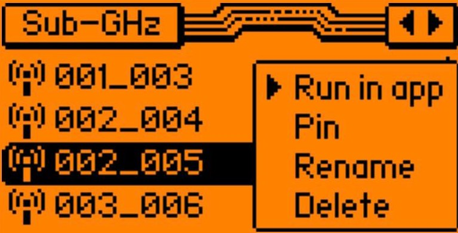
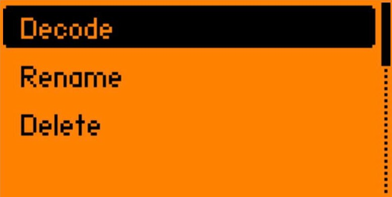
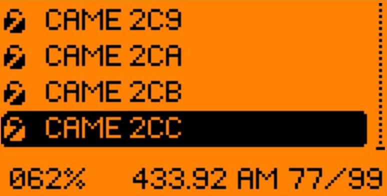
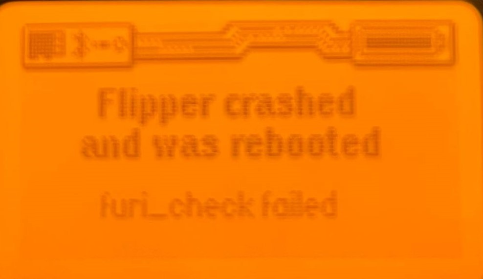
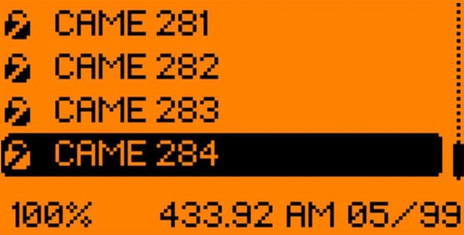
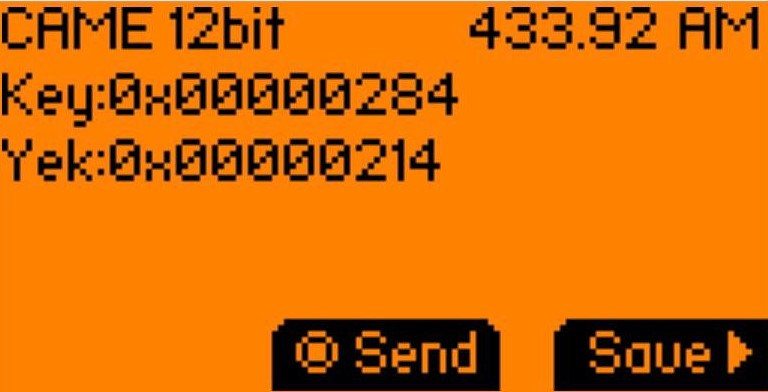

# **Tutorial Brute Force SubGhz** con aggiunta decodifica key <br><br><b>Tutte le guide qui inserite hanno il puro scopo di sperimentazione. <p>
Noi, e tutti quelli coinvolti o meno nella creazione, produzione e mantenimento di questi tutorial non potremo essere in alcun modo essere ritenuti responsabili per eventuali utilizzi non corretti.
In ogni caso, chiunque intenda far uso di dette informazioni deve accertarsi, ulteriormente, dell'effettiva utilizzabilità e della loro concreta idoneità all'uso che se ne intende fare nel rispetto delle leggi vigenti. </b>
    
Questo tutorial si basa su: https://github.com/tobiabocchi/flipperzero-bruteforce modificato per generare file fino ad 8bit


Quando scaricate i file per fare brute force vi scaricherá un albero di cartelle cosí suddiviso:  
```

PROTOCOLLO
    └── GRANDEZZA FILE
        └── file da lanciare

```
Inizialmente conviene lanciare il file di dimensione maggiore, è quello contenente tutti i segnali salvati. Facendo riferimento alla frequenza interessata, potrebbe volerci un discreto tempo prima di trovare il segnale.
Per poter affinare la ricerca e ridurre il tempo dell'attacco si fa' quanto segue:

Una volta trovato il segnale nel file precedentemente utilizzato si procede lanciando i file nelle cartelle di dimensione inferiore e via così fino a trovare il file più piccolo contenente  la frequenza corrispondente. I file più piccoli non sono altro che suddivisioni di quello/i più grande/i.

**Una rapida considerazione per comprendere meglio come utilizzarle.**

Consideriamo le seguenti suddivisioni delle cartelle:
```
4096
└── 4096.sub (da 0 a 4096)
2048
└── 2048_001.sub (da 0 a 2048)
└── 2048_002.sub (da 2048 a 4096)
1024
└── 1024_001.sub (da 0 a 1024)
└── 1024_002.sub (da 1024 a 2048)
└── 1024_003.sub (da 2048 a 3072)
└── 1024_004.sub (da 3072 a 4096)
...
...
...

```
**Esecuzione:**

- Lanciamo il file 4096, troviamo il segnale!
- A questo punto scegliamo di lanciare il primo file 2048_001.sub
- Troviamo nuovamente il segnale, questo significa che il prossimo passaggio andremo a provare i primi due della successiva divisione: 1024_001.sub e 1024_002.sub
- Se invece avessimo avuto corrispondenza lanciando il file 2048_002.sub avremmo dovuto cercare la divisione della seconda metà quindi: 1024_001.sub e 1024_002.sub e via così man mano che vogliamo aumentare la precisione del segnale cercato.


L'ultimo gruppo di 128 viene eseguito dal Flipper in circa 10 secondi nei quali verrà mandata tutta la sequenza di chiavi.

<div align=center></div>

Ma il nostro scopo è quello di decodificare la chiave corretta e per farlo si passa dal menu MORE (joy a destra) invece del pulsante centrale SEND

<div align=center></div>

Si presenterà un nuovo menù contenente le voci:

<div align=center></div>

Andando su <b>Decode</b> il flipper invierà in sequenza le chiavi provvedendo ad una codifica in tempo reale.
Purtroppo attualmente questa procedura non va a buon fine in quanto la memoria del flipper non riesce a gestire i file da 128 mandando in crash l'apparecchio che richiederà il reboot.

<div align=center></div>
<div align=center></div>

Per ovviare a ciò basta lavorare con dei file più piccoli (ad 8bit) che il Flipper riesce a gestire senza problemi.

Nel file <b>sub_file.rar</b> troverete i file della versione originale dei file della repo https://github.com/tobiabocchi/flipperzero-bruteforce con all'interno già generate anche le cartelle a 64, 32, 16 e 8 bit.

Si prosegue quindi seguendo il metodo sopra descritto dal 128 a scendere fino a ricavare il file a 8 bit che potrà essere quindi inviato tramite il menu decode che arriverà al 100% senza stavolta causare crash riuscendo quindi a decodificare correttamente le 8 key.
    
<div align=center></div>
    
Sarà sufficiente quindi mandare singolarmente le 8 chiavi decodificate e salvare la chiave che farà aprire il varco.
    
<div align=center></div>

Troverete allegato anche il file <b>flipperzero-bruteforce.py</b> preso da https://github.com/tobiabocchi/flipperzero-bruteforce e modificato per generare sottocartelle fino ad 8 bit.

Per quanto riguarda invece l'aggiunta di nuovi protocolli è molto semplice: all'interno dello script py i protocolli sono definiti in fondo, all'interno dell'elenco dei protocolli

```
protocols = [

    Protocol("CAME", 12, {"0": "-320 640 ", "1": "-640 320 "}, "-11520 320 "),
    
    Protocol("NICE", 12, {"0": "-700 1400 ", "1": "-1400 700 "}, "-25200 700 "),
    
    Protocol("8bit", 8,  {"0": "200 -400 ", "1": "400 -200 "}),  # generic 8 bit protocol
    
    ...
    
]
```

Un protocollo è definito da alcuni parametri passati al costruttore nel seguente ordine:

- nome: il nome del protocollo
- n_bits: il numero di bit per una singola chiave
- transposition_table: come vengono tradotti gli 0 e gli 1 nel linguaggio flipper subghz .sub
- pilot_period: (preamble) uno schema ricorrente all'inizio di ogni chiave, inesistente per default
- stop_bit: uno schema ricorrente alla fine di ogni chiave, inesistente per default
- frequenza: frequenza di lavoro, il valore predefinito è 433.92
- ripetizione: numero di trasmissioni per chiave nel brute force

# Download file necessari
- [flipperzero-bruteforce.py](flipperzero-bruteforce.py)
- [sub_files.rar](sub_files.rar)


